## Software as a Service - Back-End Development

## Diploma of Information Technology (Advanced Programming)  

#

## Diploma of Information Technology (Back-End Development)

Replace GIVEN_NAME_HERE, FAMILY_NAME_HERE and STUDENT_ID_HERE entries with your details:

| Given Name | Family Name | Student ID  |
|------------|-------------|-------------|
| Kelden     | Wangmo      | 20070505    |


# Declaration

I, THE ABOVE NAMED student, by submitting this assessment, I am acknowledging the following:

- The submission is completely my own work.
- I have not used AI in the formation of the answers within this assessment.
- I have acknowledged all sources of information used in this work (if required).
- I have kept a copy of this assessment (where practicable).
- I understand a copy of my assessment will be kept by TAFE for their records.
- I understand my assessment may be selected for use in the TAFEs validation and audit process to ensure student assessment meets requirements.

When submitting this assessment, I am accepting the above acknowledgement.


---

```table-of-contents
title: # Contents
style: nestedList
minLevel: 0
maxLevel: 3
includeLinks: true
```

---

# How to Answer Questions

Each time you answer a question, fill out the space provided for the answer to the question.

## Answer Requiring an Explanation

Answers to questions should be completed as "block quotes", replacing the `ANSWER_HERE` with the answer, and preceding each line with a greater than sign `>`. To add a new paragraph ensure you leave a `>` with no text after it.

Example:

```markdown
    

## Question Z - How many sofwarte developers does it take to change a lightbulb?
    
    > None. 
	> It is a hardware problem.
```

## Answer Requiring Code

When answering a question that requires code to be included, use a "code block", which starts with three back-ticks (/`) plus the language for the code (e.g. php, js, cpp, python, shell, text, et al).

Example:

```markdown
	

## Question X - Title

	Query Solution:

	```js
	db.collection_name.find();
	```
```

> Note: 
>
> The NoSQL code used to answer the question is contained in a code block,wich opens with three back-ticks (\`\`\`) followed by js, contains the code on the lines below, and ends with three back-ticks (\`\`\`) at the start of the next line after the code. An example is shown above.
> 
> It is important that code blocks start at the beginning of the line for formatting on GitHub, Obsidian or your preferred IDE render the code correctly.

## Answer Requiring Image(s) to Be Inserted

Images are to be saved in a folder called "`assets`" and are embedded into the Markdown document.

Images for this assessment MUST be named in the form `step-X-Ya.ext` where:

- `X` is the step number (e.g. for step 5 the number is `5`)
- `Y` is the question dot number (e.g. for question `2.3` the dot number is `3` )
- `a` is an optional letter to allow for multiple images for an answer.
- `ext` is the filename extension (e.g. `png`, `jpg`, `jpeg`, `svg`, et al)

To insert an image use the following syntax:

```markdown

```

For example, the markdown code:

```markdown
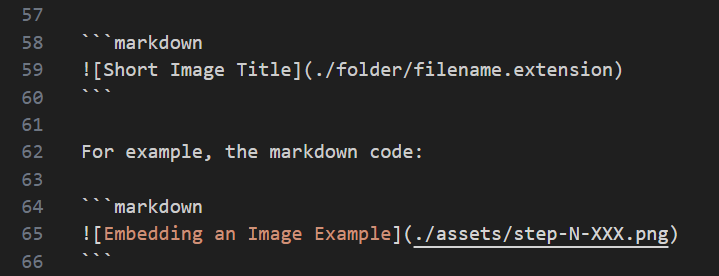
```

Gives:


---


# Step 1: Setting Up for Assessment

This step provides a checklist for yout to ensure you have set up the assessment requirements as needed.


## Checklist

Put an X between each of the pairs of `[ ]` when you have completed the task:

> - [X] Create a new **empty** & **private** repository on GitHub (or the equivalent).
> - [X] Repository is named `xxx-ICT50220-SaaS-2-BED-NoSQL` replacing `xxx` with your initials.
> - [X] Cloned the repository to your local PC.
> - [X] Created a new folder called `assets` inside your cloned repository.
> - [X] Created an empty `ReadMe.md`.
> - [X] Created an empty `.gitignore` file in the assets folder.
> - [X] Downloaded the provided `sample.gitignore` file, moved it into the repository folder, and renamed it to `.gitignore`.
> - [X] Placed a copy of the assessment's Word document into the repository folder.
> - [X] Added all the new files and folders to the repository, commited them to version control, and pushed them to your private remote repository.

---

# Step 2: NoSQL Systems

This step verifies you understand concepts that includes, but is not limited to such as databases, collections, fields, documents and naming conventions.

## 2.1 Defining Terms

Briefly explain what is meant by the terms database, collection, document and field in terms of MongoDB.

> - A Document is the smallest unit of data storage, represented in BSON (Binary JSON) format in MongoDB.
> - A collection  is a group of related documents that correspond to an entity.
> - Database is a container for collections. A group of collections is housed in a database.
> - Fields are the fundamental building blocks of MongoDB documents, similar to columns in relational databases.
>  They define the structure and data stored within a document. A field is represented as a key-value pair.

## 2.2 NoSQL Database Types

Briefly outline the key features and advantages for TWO of the following NoSQL database types:

- Document Database
- Key-Value Store
- Wide-Column Oriented Database
- Graph Database

> #

## Database Type 1: Document Database
>
>  A document database stores data as flexible documents, typically in JSON or BSON format.
Each document can have a different structure, making the database highly adaptable to changing requirements.

Advantages:

* Flexible schema allows easy handling of unstructured or semi-structured data.
* Scales horizontally across multiple servers.
* Stores complex objects in a single document, reducing the need for joins.
* Well suited for content management systems, e-commerce platforms, and web applications.


## Database Type 2: Graph Database
>
> A graph database stores data as nodes (entities) and edges (relationships), making relationships a first-class component of the data model.

Advantages:

* Efficiently handles highly connected data.
* Enables fast traversal of complex relationships.
* Ideal for social networks, recommendation engines, fraud detection, and network analysis.
* Simplifies queries involving multiple relationships compared to relational databases.


## 2.3 NoSQL Database Systems

Provide one example product (commercial or open source) for each of your NoSQL NoSQL Database types.

You may **NOT** include _MongoDB_ which is an example of a _Document Database_.

```text
Provide one example product (commercial or open source) for each of your NoSQL Database types.
You may **NOT** include _MongoDB_which is an example of a _Document Database_.

One example product for each of the NoSQL Database types:
- Document Database: Couchbase | [couch-base](https://docs.couchbase.com/home/index.html)
  Couchbase combines document-oriented and key-value data models, offering flexibility and high performance
  
- Graph Database: Neo4j | [neo4j](https://neo4j.com/product/neo4j-graph-database/)
  Neo4j is a native graph database designed to store, manage, and query connected data efficiently.

```


## 2.4 NoSQL Database Uses
Provide an example for each of your NoSQL database of the situation when your database types may provide a benefit when used.

The situations/application of the database types must be different.

```text
Provide one example product (commercial or open source) for each of your NoSQL Database types.
You may **NOT** include _MongoDB_which is an example of a _Document Database_.

One example product for each of the NoSQL Database types:
- Document Database: Couchbase | [couch-base](https://docs.couchbase.com/home/index.html)
  Couchbase combines document-oriented and key-value data models, offering flexibility and high performance
  
- Graph Database: Neo4j | [neo4j](https://neo4j.com/product/neo4j-graph-database/)
  Neo4j is a native graph database designed to store, manage, and query connected data efficiently.

```

## Database Type 1: Document Database = Couchbase
```text
The situations/application of the database types must be different.

1. Document Database = Couchbase  
   Situation : Due to Couchbase's high performance and low latency it is suitable for a variety of use cases such as:
    - Real-Time Analytics: Couchbase is ideal for performing real-time analytics on a large data sets.
    - E-Commerce and Customer Management: Couchbase is also used for E-commerce to manage transactions efficiently and
      can manage high volumes of customer data.
```

## Database Type 2: Graph Database
```text
Situation:  Due Neo4j's ability to manage large-scale, interconnected data it is well-suited for a variety of use cases such as:
   - Fraud Detection: Neo4j's graph model makes it easy to identify patterns and anomalies in these relationships, allowing 
     fraud analysts to quickly detect and prevent fraudulent activity. Neo4j can be used to build fraud detection systems for 
     industries like banking, insurance and e-commerce.    
   - Healthcare management systems: Healthcare involves managing and analyzing complex relationships between patients, medical professional, 
     medical records and treatments. Neo4j's graph-based model is well-suited to represent these relationships as a network of nodes and 
     relationships. Neo4j can be used to build healthcare management systems that allow doctors and healthcare professionals to navigate and analyze 
     medical data and patient records. 
```

# Step 3: NoSQL Databases & Collections

## 3.1 Naming Databases, Collections and Fields

What naming convention will you use for the database, collections and fields used in the assessment scenario?

> For the NoSQL database naming conventions I would select for each convention would be:
>
| MongoDB    | Recommended Style | Example                 |
|------------|-------------------|-------------------------|
| Database   | snake_case        | student_portal          |
| Collection | snake_case        | orders, user_profiles   |
| Field      | camelCase         | createdAt, emailAddress |

Justify why did you choose this naming convention?
> -  Justification on why this naming convention was chosen.
> - Databases serve as the foundation for our collections. Naming them effectively will help clearly describe the data it contains. It should
    > be descriptive and leave no confusion. Watch out for spaces at the beginning or end of database names. MongoDB use JavaScript or JSON-based formats.
    > snake_case is clearer for database and collection names.
> - Collections are like containers that holds related documents. Choosing right names for it should tell a detail of what kind of data
    > they hold. Lowercase collection names are preferred. Choosing a camelCase of snake_case either is appropriate. However, they must be consistent.
> - Fields should be descriptive and simple, they should not leave any confusion. They should hold lower cases to keep things uniform
    > and simple and stay the course with whatever naming convention we choose, hold with it. Using camelCase for field name helps with this.


## 3.2 Connecting

```text
Connect to a running instance of MongoDB (preferred to be your MongoDB Atlas instance). 
- What was the connection string used to connect to your instance of MongoDB? 
Give the connection string and a complete CLI command using the MongoDB shell. 
Example: mongos mongodb://192.168.0.5:9999/foo 
```

Add the Connection String used to connect to your MongoDB Atlas instance:

> ```js
> $ mongosh mongodb+srv://20070505_db_user:<YOUR_PASSWORD>@cluster0.wxkuth2.mongodb.net/
> ```

## 3.3 Database Creation

- Create and use a database named `saas_bed_portfolio_2025s2`.

> ```js
> use saas_bed_portfolio_2026S1
> ```

Did you encounter any issues when creating the database? If you did, how did you resolve them?

> Yes, I had MongoServerError: bad auth :authentication failed due to wrong password.

If you did, how did you resolve them?
> Inserted the correct credentials to connect to my MongoDB Atlas

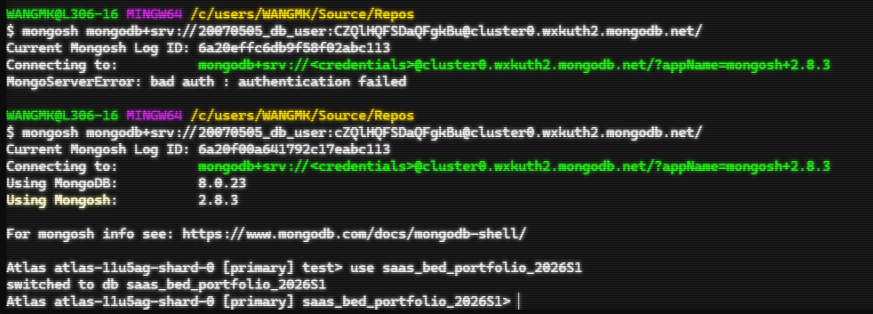

## 3.4 Schema Design for Collection

Using the sample data provided, identify the field types and suitable names for the data storage in a MongoDB database.

In the `notes` column, add any clarifying details (such as rules) that may be useful.

Replace `FIELD_NAME_HERE` and `DATA_TYPE_HERE` in the table below.

| Field Name      | MongoDB Data Type  | Example Data              |
|-----------------|--------------------|---------------------------|
| title           | String             | Aliens                    |
| year            | Integer            | 2009                      |
| writers         | Array of strings   | Sean Bean, Isaac Newton   |
| franchise       | String             | Avatar                    |
| running time    | Integer (minutes)  | 162                       |
| budget          | Long integer (USD) | 237000000                 |
| actors          | Array of strings   | Kiefer Sutherland, Rex    |
| directors       | Array of strings   | Patrick Stewart           |
| summary         | String             | Ipsum lorem exa dux       |
| random          | Integer (Double)   | 0.44                      |
| imdb id         | String             | tt0499549                 |
| imdb rating     | Integer            | 7.9                       |
| rotten tomatoes | Integer            | 34                        |
| genres          | Array of Strings   | Drama, Sci-Fi             |
| updated_at      | Date               | 2026-05-22T08:53:23.387Z  |

> What data type are you using for each field?
> The movie collection will store a variety of MongoDB data types. String data types will be used for
> fields such as `title`, `franchise`, `summary`, and `imdb_id`.
> Integer data types will be used for `year`, `running_time`, and `rotten_tomatoes`.
> The budget field will use the Long data type to support large currency values.
> Arrays of strings will be used for `writers`, `actors`, `directors`, and `genres` because multiple values can be stored in a single field.
> The `random` field will use the Double data type to store decimal values.


> Identify the validation rules you wish to apply
> * title is required and must be a string.
> * year is required and must be an integer.
> * year should be between 1888 and 2100.
> * running_time must be a positive integer.
> * budget must be a long integer and cannot be negative.
> * writers, actors, directors, and genres must be arrays of strings.
> * imdb_id is required and must follow the IMDB format, such as tt0499549.
> * rotten_tomatoes must be an integer between 0 and 100.
> * random must be a double between 0 and 1.
> * updated_at must be date values.
> * box_office → Long / Int
> * imdb_rating → Double or Null
> * imdb_id → String or Null
> * rotten_tomatoes → Int or Null

- Provide the schema validation code for the collection.

 ```js
 	db.createCollection("films", {
            validator: {
            $jsonSchema: {
            bsonType: "object",
            required: ["title"],
            description: "Film collection documents",
    
          properties: {
            _id: {
              bsonType: "objectId",
              description: "Unique document identifier"
            },
    
            title: {
              bsonType: "string",
              description: "Movie title"
            },
    
            year: {
              bsonType: "int",
              description: "Year the film was released"
            },
    
            writers: {
              bsonType: "array",
              description: "List of writers",
              items: {
                bsonType: "string"
              }
            },
    
            franchise: {
              bsonType: "string",
              description: "Film franchise name if applicable"
            },
    
            running_time: {
              bsonType: "int",
              description: "Running time in minutes"
            },
    
            budget: {
              bsonType: ["int", "long", "null"],
              description: "Production budget"
            },
    
            box_office: {
              bsonType: ["int", "long", "null"],
              description: "Box office revenue"
            },
    
            actors: {
              bsonType: "array",
              description: "List of actors",
              items: {
                bsonType: "string"
              }
            },
    
            directors: {
              bsonType: "array",
              description: "List of directors",
              items: {
                bsonType: "string"
              }
            },
    
            summary: {
              bsonType: "string",
              description: "Brief plot summary"
            },
    
            random: {
              bsonType: ["double", "int"],
              description: "Random value used for sampling"
            },
    
            genres: {
              bsonType: "array",
              description: "List of genres",
              items: {
                bsonType: "string"
              }
            },
    
            imdb_id: {
              bsonType: ["string", "null"],
              description: "IMDb identifier"
            },
    
            imdb_rating: {
              bsonType: ["double", "int", "null"],
              description: "IMDb rating"
            },
    
            rotten_tomatoes: {
              bsonType: ["int", "null"],
              description: "Rotten Tomatoes score"
            },
    
            updated_at: {
              bsonType: "date",
              description: "Date the document was last updated"
            }
          }
        }
    }
});
```

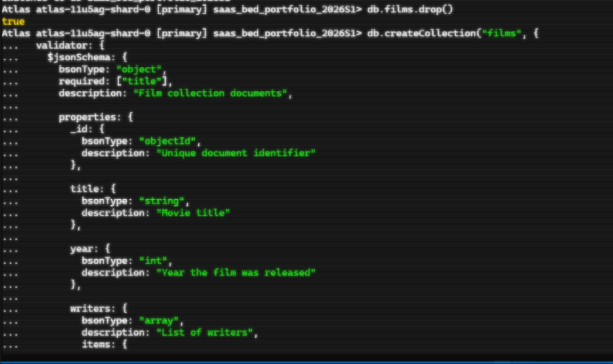


## 3.5 Collection Creation

- Create a new collection named _films_ and insert the provided data (full statement)

Using db.collections.insertOne()

> ```js
db.films.insertOne({
title: "Star Trek: Nemesis",
year: 2002,
writers: ["John Logan", "Rick Berman", "Brent Spiner"],
summary: "A clone of Picard, created by the Romulans, assassinates the Romulan Senate, assumes absolute power, and lures Picard and the Enterprise to Romulus under the false pretext of a peace overture.",
franchise: "Star Trek",
running_time: 117,
budget: 60000000,
box_office: 67300000
})
> ```

Screen Shot:

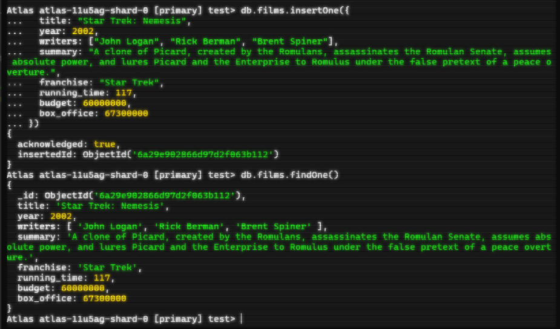

# Step 4: CRUD - Create


## 4.1 Inserting Data

- Add the supplied sample data into the films collection using a **SINGLE** MongoDB Shell COMMAND in the order provided.

Query Solution:

```js
db.films.insertOne({
    title: "My Dearest Assassin",
    year: 2026,
    writers: ["Watthana Veerayawatthana"],
    actors:["Pimchanok Luevisadpaibul", "Tor Thanapob Leeratanakachorn", "Sivakorn Adulsuttikul"],
    running_time: 127,
    budget: 237000000,
    genres: ["Action", "Romance", "Thai", "Thriller", "Drama"]
})	
db.collection_name.find();
```

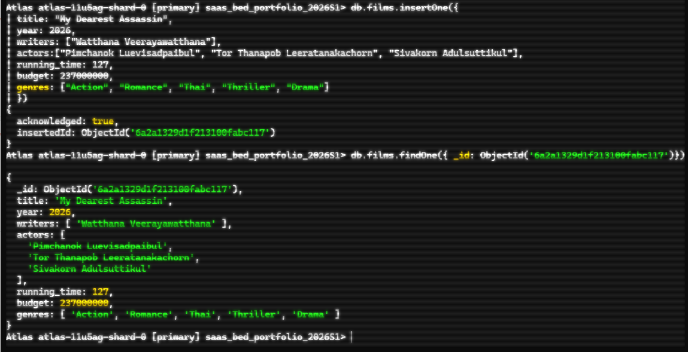
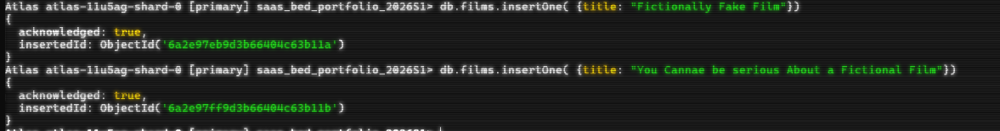

## 4.2 Inserting Data

From the LMS, download the provided data files, and determine which one you will use to import data into the collection. 

The options are: `film-data-tsv.txt`, `film-data-csv.txt`, and `film-data-json.txt`.

Using the `mongoimport` CLI command, import the data from one of the files to your collection.

What was the complete command you used to perform the import of the provided sample data?

Query Solution:

```text
film-data-json.txt
```

```php
$ mongoimport --uri "mongodb+srv://20070505_db_user:<MY_PASSWORD>@cluster0.wxkuth2.mongodb.net/saas_bed_portfolio_2026S1" --collection "
films" --type json --file "film-data-json.txt" --jsonArray
```
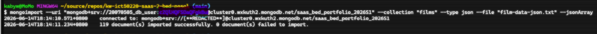


## 4.3 Inserting Data

Add the provided additional sample data into the films collection in the order provided.

> You do not have to add any details to the answers.md for this question.

```text
db.films.insertMany([
{
title: "Pride",
year: 2014,
writers: ['Stephen Beesform'],
franchise: "",
running_time: 192,
imdb_rating: 7.8
},
{
title: "Pee Wee Herman's Big Adventure",
},
{
title: "A Fictional Tale as a Fake Film",
}
])
{
```

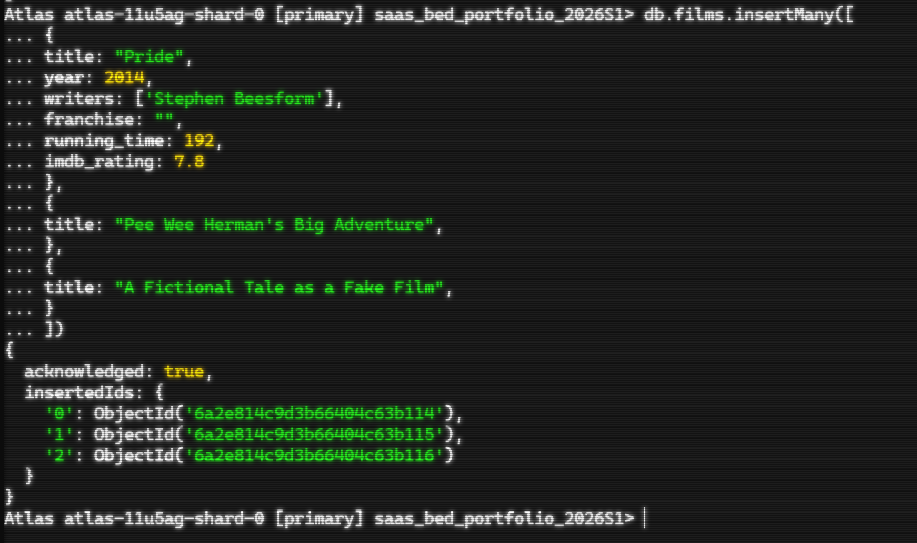


# Step 5: CRUD - Retrieve Queries


## 5.1 Retrieve all documents

- Get all documents from the films collection.

Query Solution:

```js
db.films.countDocumnents(); 
db.films.find();
```
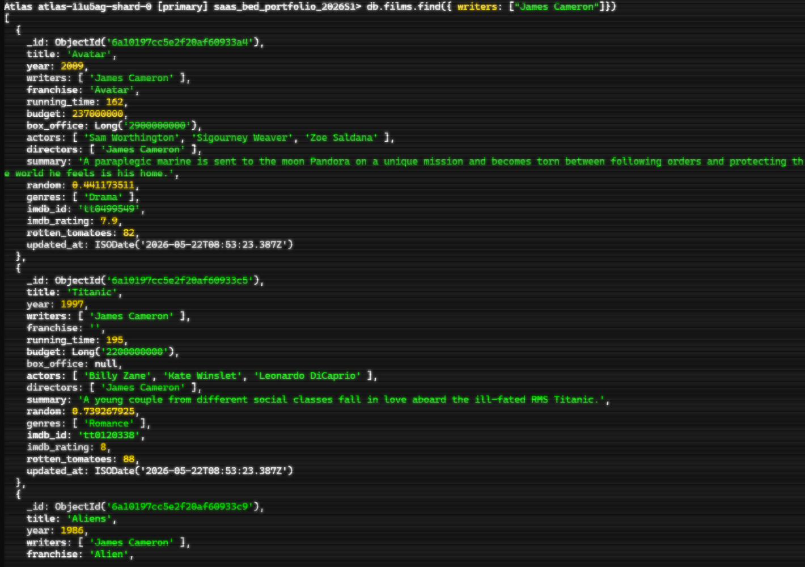
	


## 5.2 Retrieve all films written by…

- Get all documents with `writer` set to "`Quentin Tarantino`"

Query Solution:

```js
db.film.find(
{
    writers: ["James Cameron"]
})
```

Screen Shot:


## 5.3 Retrieve films with actor(s)…

- Get all documents where `actors` include "`Brad Pitt`"

Query Solution:

```js
db.films.find({ actors: "Kate Winslet"}); 
```
Screen Shot:
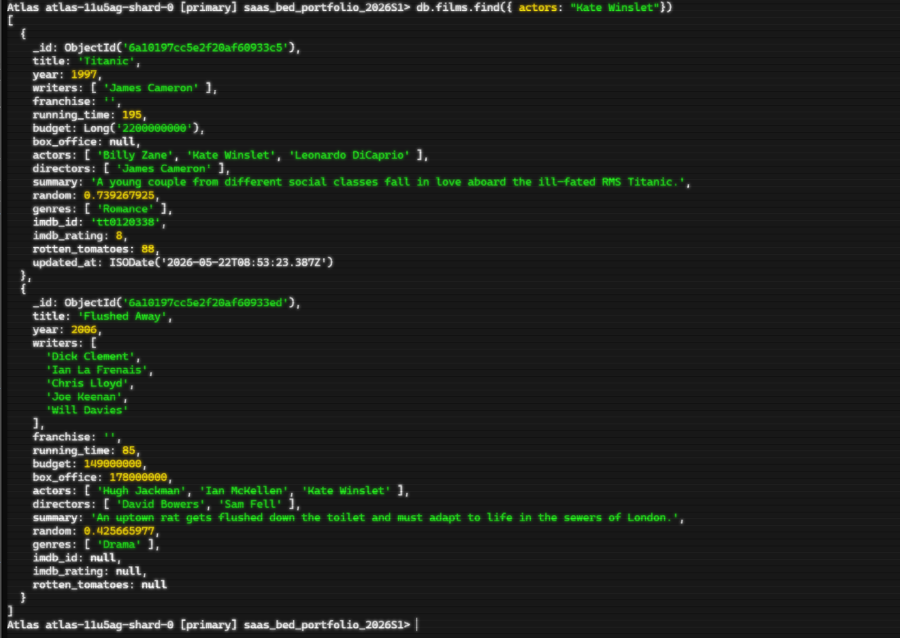
	


## 5.4 Retrieve films from a franchise…

- Get all documents with `franchise` set to "`The Hobbit`"

Query Solution:

```js
db.films.find({franchise: "The Hobbit"});
db.films.find({franchise: "The Hobbit"}).count();
```

Screen Shot:
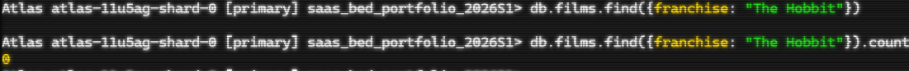

### Explanation

This query retrieves all film documents where the `franchise` field is equal to `"The Hobbit"`.


## 5.5 Retrieve films released in range…

- Get all films released between `1980` and `2020`

Query Solution:

```js
	db.films.find({
    year: {
        $gte: 1980,
        $lte: 2020
    }
})
```
	
Screen Shot:

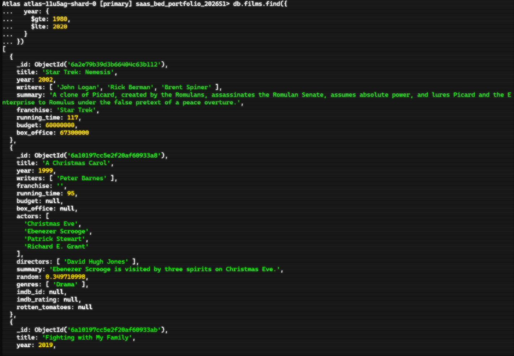


## 5.6 Retrieve films longer than…

- Get all films with a running time of over `120` minutes

Query Solution:

```js
	db.films.find({ running_time: { $gt: 120} })
```

Screen Shot:

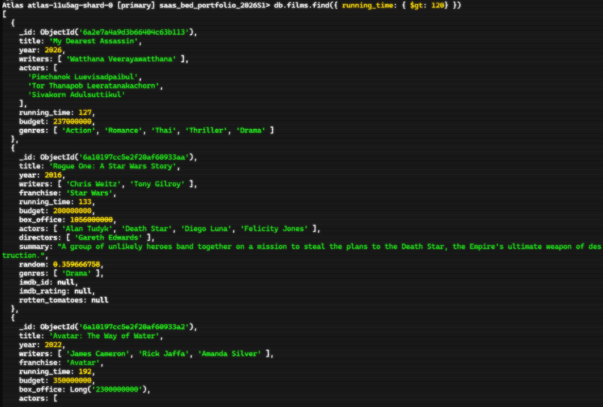

## 5.7 Retrieve films released in range…

- Get all films released after `2022`.

Query Solution:

```js
	db.films.find({ year: { $gt: 2022} })
```
	
Screen Shot:

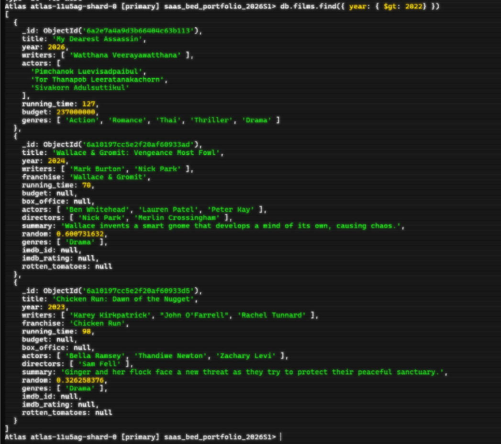


# Step 6: CRUD - Updates

## 6.1 Update document with a synopsis

- Using one or more queries, add the provided synopses to the indicated films.

Query Solution:

```js
	db.films.updateOne(
    {
        title: "The Hobbit: The Desolation of Smaug" },
    {
        $set: {
            summary:  "The dwarves, along with Bilbo Baggins and Gandalf the Grey, continue their quest to reclaim Erebor, their homeland, from Smaug. Bilbo Baggins is in possession of a mysterious and magical ring."
        },
    })
```
```js
db.films.updateOne(
{
title: "The Hobbit: An Unexpected Journey" },
{
$set: {
summary:  "A reluctant hobbit, Bilbo Baggins, sets out to the Lonely Mountain with a spirited group of dwarves to reclaim their mountain home - and the gold within it - from the dragon Smaug."
},
})
```
	


## 6.2 Update document with an actor

- Add the provided actors to the required films using one or more queries in the order provided...

Query Solution:

```js
	db.films.updateOne(
    { title: "Pulp Fiction" },
    {
        $push: {
            actors: {
                $each: ["Samuel L. Jackson"]}
        } })
```

Screen Shot:

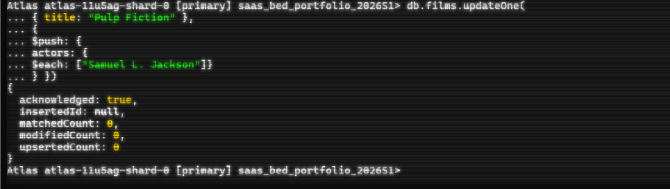
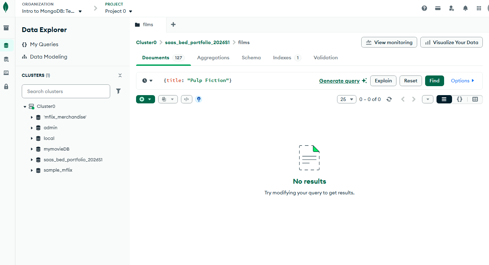

> There is no film with the name titled "Pulp Fiction" found.

```js
db.films.updateOne(
  { title: "Star Trek VI: The Undiscovered Country" },
  {
    $push: {
      actors: {
        $each: [
          "William Shatner",
          "Leonard Nimoy",
          "DeForest Kelley",
          "James Doohan",
          "Christopher Plummer",
          "Walter Koenig",
          "Nichelle Nichols",
          "George Takei",
          "Kim Cattrall",
          "David Warner"
        ]
      }
    }
  }
)
```
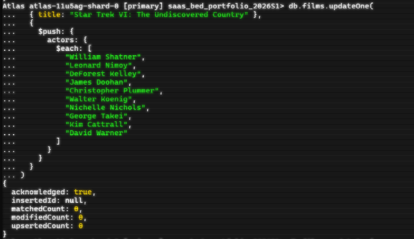


```js
db.films.updateOne(
  { title: "Star Trek: Nemesis" },
  {
    $push: {
      actors: {
        $each: [
          "Patrick Stewart",
          "Jonathan Frakes",
          "Brent Spiner",
          "LeVar Burton",
          "Michael Dorn",
          "Gates McFadden",
          "Marina Sirtis"
        ]
      }
    }
  }
)
```
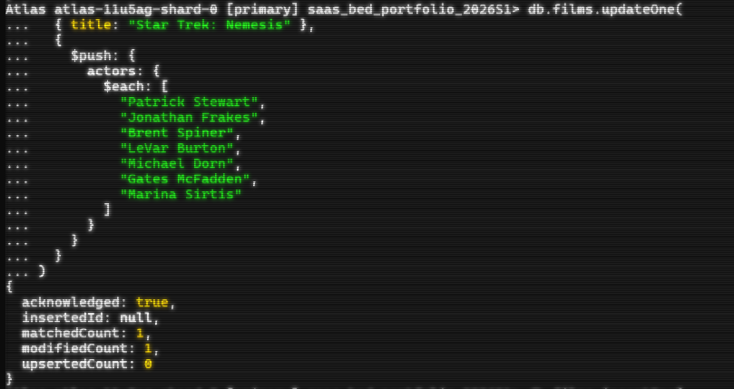

```js
db.films.insertOne(
{ title: "Star Trek VI: The Undiscovered Country" }
)
 

db.films.updateOne(
  { title: "Star Trek VI: The Undiscovered Country" },
  {
    $push: {
      actors: {
        $each: [
          "Patrick Stewart",
          "Jonathan Frakes",
          "Brent Spiner",
          "LeVar Burton",
          "Michael Dorn",
          "Gates McFadden",
          "Marina Sirtis"
        ]
      }
    }
  }
)
```
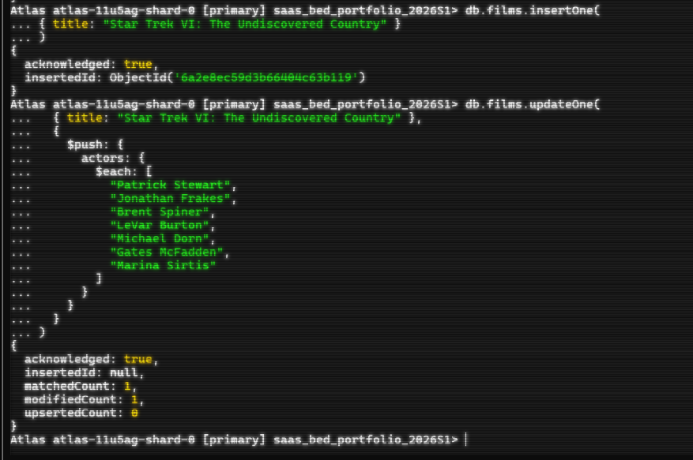

# Step 7: CRUD – Searches

Performing searches on collections.


## 7.1 Searching for titles with …

- Find all films with the `title` starting with "`T`".

Query Solution:

```js
	db.films.find({
    title: { $regex: "^T" }
})
```

Screen Shot:

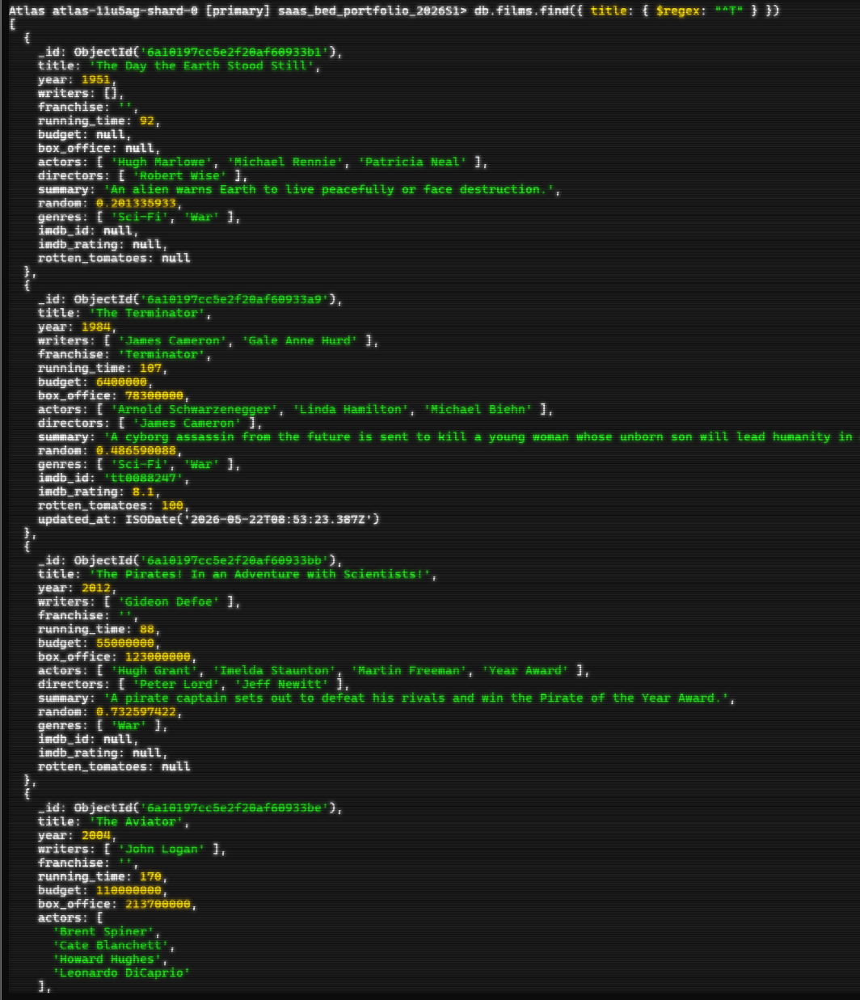

### Explanation

This query uses a regular expression to find all films where the `title` field begins with the letter "T".
The `^` symbol indicates the start of the string.


## 7.2 Searching for synopses with …

- Find all films that have a `genre` that contains the letters "`th`"

Query Solution:

```js
	db.films.find({
    genre: { $regex: "th", $options: "i"} 
})
```

Screen Shot:

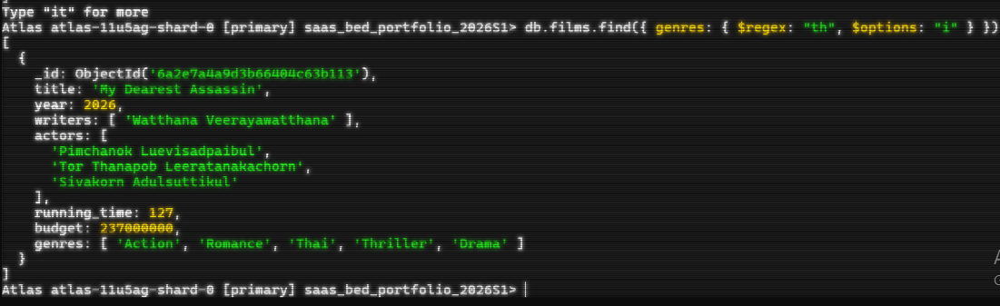

### Explanation
* $regex: "th" searches for the letters "th" anywhere in the genre field
* $options: "i" makes the search case-insensitive.


## 7.3 Searching for synopses with… and not …

- Find all films that have a `synopsis` that contains the word "`Captain`" and not the word "`Pike`"

Query Solution:

```js
	db.films.find({
    summary: {
        $regex: "Captain",
        $options: "i",
    },
    $nor: [{
        summary: {
            $regex: "Pike",
            $options: "i"
        }
    }]
})
```

Screen Shot:

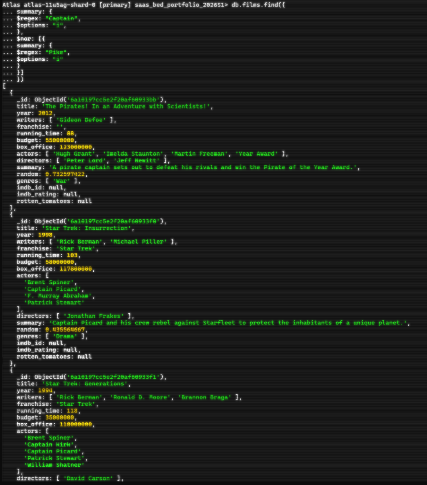

### Explanation
* This query finds films whose synopsis (`summary`) contains the word "Captain" but does not contain the word "Pike".
* The `i` option makes the search case-insensitive.

## 7.4 Searching for synopses with … or …

- Find all films that have a `synopsis` that contains the word "`London`" or "`Brooklyn`"

Query Solution:

```js
	db.films.find({
    $or: [ {summary: /London/i },
        {summary: /Brooklyn/i },
    ] })
```

Screen Shot:

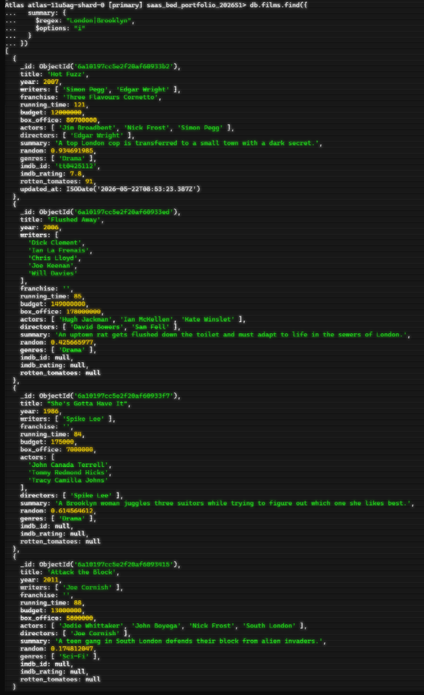

### Explanation

* This query uses the `$or` operator to find films whose synopsis (`summary`) contains either the word "London" or the word "Brooklyn".
* The `i` option makes the search case-insensitive.

## 7.5 Searching for synopses with … and …

- Find all films that have a synopsis that contains the words "`team`" and "`search`"

Query Solution:

```js
	db.films.find({
    $and: [
        { summary: /team/i },
        { summary: /search/i }
    ]})
```

Screen Shot:

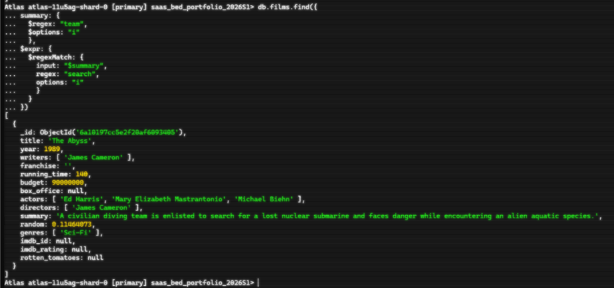

### Explanation

- This query uses the `$and` operator to find films where the `summary` field contains both the word **"team"** and the word **"search"**.
- Each regular expression checks for one word, and both conditions must be true for a document to be returned.
- The `i` option makes the search case-insensitive.

# Step 8: CRUD - Deletions

This step requires you to remove films from the collection.

## 8.1 Removing a film using its title…

- Use the title to delete the film "`Pee Wee Herman's Big Adventure`"

```js
db.films.deleteOne({ title: "Pee Wee Herman's Big Adventure"})
```

Screen Shot:
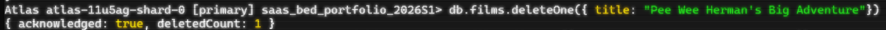

## 8.2 Remove a film by ID…

Delete the film “`Fictionally Fake Film`” by:

- Writing a query to discover the film ID
- Then using the found ID to remove the film

Query Solution:

```js
db.films.findOne({ title:  "Fictionally Fake Film"})
db.films.deleteOne({ _id: ObjectId('6a2e97eb9d3b66404c63b11a') })
```

Screen Shot:

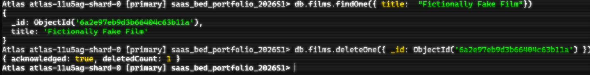

> Find the ObjectId for the film titled "Fictionally Fake Film", then delete film by _id.


## 8.3 Removing multiple films…

- Delete any films with the exact word “`Fictional`” in their title, ignoring case.

Query Solution:

```js
	db.films.deleteMany({
    title: {
        $regex: "Fictional",
        $options: "i"
    }
})
```

Screen Shot:

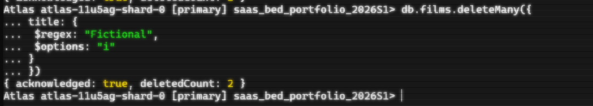


# Step 9: NoSQL Indexes

Using the films collection, create the indexes to match the following conditions:


## 9.1 Indexes for Sorting

- Create an index on the `title` field.

Query Solution:

```js
	db.films.createIndex({
    title: 1,
})
```
### Index 1
Creates an ascending index on the `title` field to improve query performance when searching or sorting by title.


- Create an index on the `year` and `title ` fields.

Query Solution:

```js
	db.films.createIndex({
    year: 1,
    title: 1
})
```
### Index 2
Creates a compound index on the `year` and `title` fields.
Queries that filter or sort by year and title can use this index.


- Create an index on the `franchise`, `title`, `actors`, `year` fields.
- The index must be in the order year, title, actors then franchise.

Query Solution:

```js
	db.films.createIndex({
    year: 1,
    title: 1,
    actors: 1,
    franchise: 1 })
```
### Index 3
Creates a compound index on the `year`, `title`, `actors`, and `franchise` fields in that order.

Screen Shot:
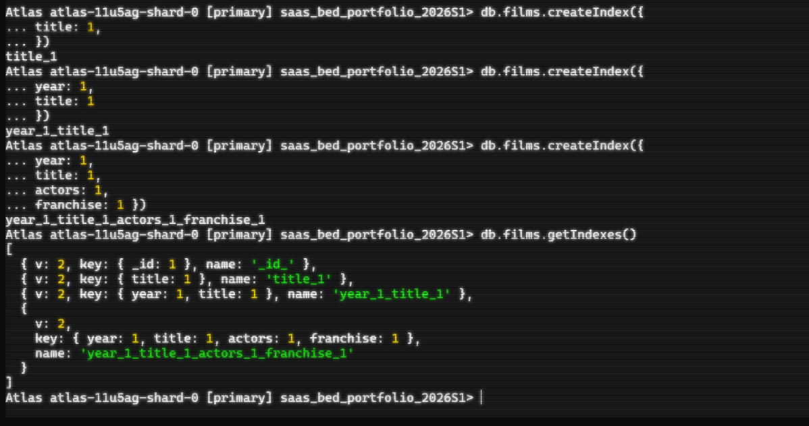

## 9.2 Indexes for Full Text Search

- Create a text index on the `title ` and `summary` fields.

Query Solution:

```js
	db.films.createIndex({
    title: "text",
    summary: "text"
})
```
Screen Shot:
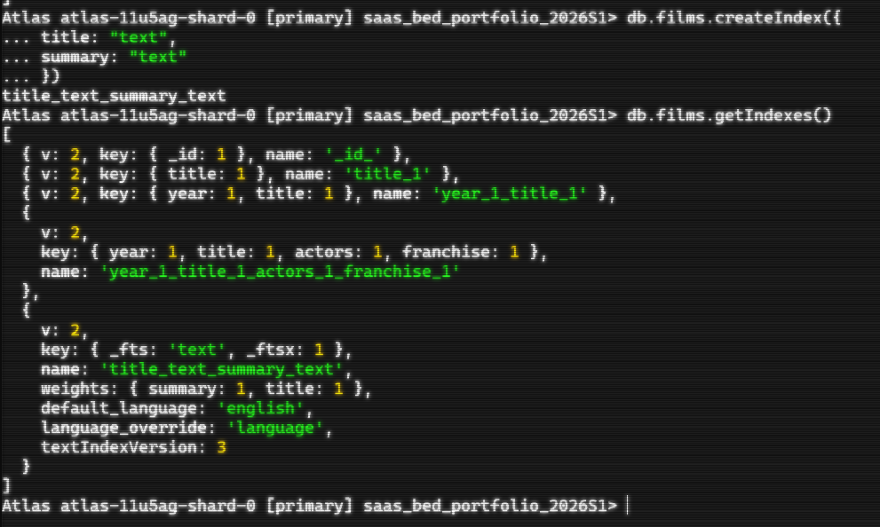

### Explanation

This command creates a text index on the `title` and `summary` fields.
A text index allows MongoDB to perform full-text searches, making it possible to search for words and phrases within film titles and summaries using the `$text` operator.


## 9.3 Verifying Execution Plans

- Check the execution plan for a query that finds the films with a title containing “Star”. 
- Check if the created index is being used.

Query Solution:

```js
	db.films.find({
    title: /Star/
}).explain("executionStats")
```

Screen Shot:

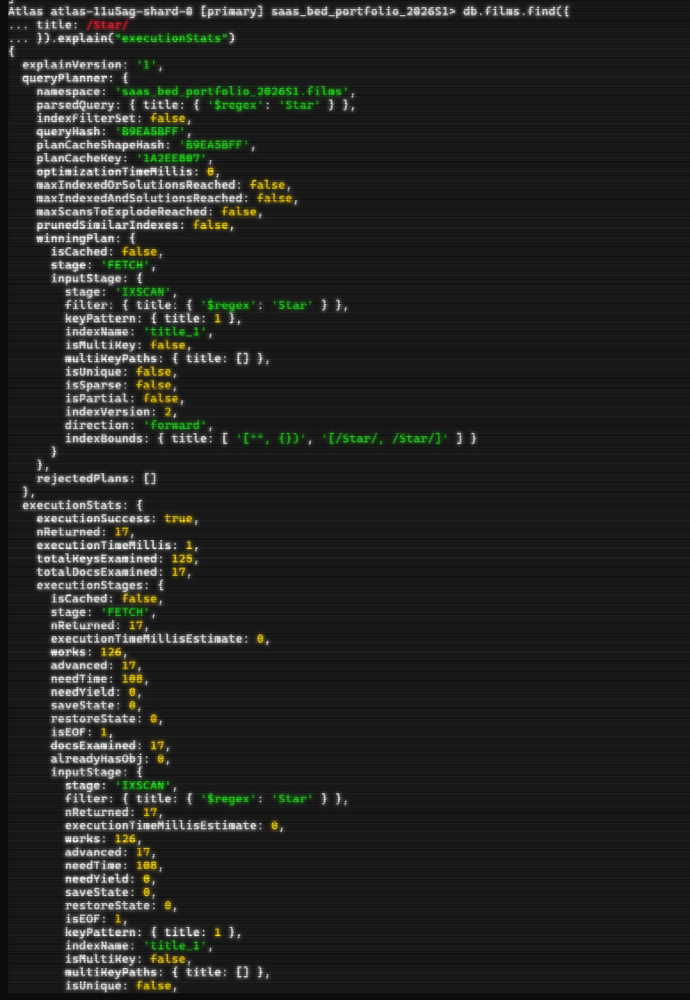

> stage: 'IXSCAN',
> indexName: 'title_1'

> This query checks the execution plan for films with titles starting with "Star".
> In the explain output, `IXSCAN` means the title index is being used.


## 9.4 Differences in Indexes

- Briefly explain the differences between an index for sorting against an index for full text searches.
- Include in your answer when each is best suited for use.

> - A standard index(such as an ascending index on `title`) is designed to improve the performance of queries that filer,
sort, or retrieve data based on specific field values.
> - A full-text search index is designed for searching words and phrases within text fields. Instead of matching exact
  values, MongoDB breaks text into searchable terms and allows users for keywords contained within documents.

### When to use each:
**Sorting Index**
> - Best used when filtering or sorting data by specific fields:
> - For example;
    >   - Finding films released in a particular year.
    >   - Sorting films alphabetically by title.
>   - Looking up a film by its exact title.

**Full-Text search Index**
> - Best used when searching for words or phrases withing large text fields.
> - For example;
    >   - Finding films whose summary contains the word "Captain".
    >   - Searching for films related to "outdoor adventure"
>   - Looking for keywords within titles and summaries.


# Step 10: Aggregation

In this step you will be aggregating data within a collection.


## 10.1 Counting documents

- Write an aggregation query to count the number of `Star Trek` films.

Query Solution:

```js
	db.films.aggregate([
    {
        $match: { franchise: "Star Trek" }
    },
    { $count: "star_trek_films" }
])
```
Screen Shot:
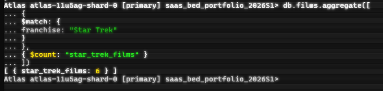

> This aggregation pipeline first filters the collection to include only documents where the `franchise` field is `"Star Trek"` using `$match`.
> The `$count` stage then counts the number of matching documents and returns the total number of Star Trek films.


## 10.2 Mean budget and box office takings…

- Write an aggregation query to calculate the average budget and box office takings.
- Display both values.

Query Solution:

```js
	db.films.aggregate([
    {
        $group: {
            _id: null,
            average_budget: { $avg: "$budget" },
            average_box_office: { $avg: "$box_office" }
        }
    }
])
```

Screen Shot: 
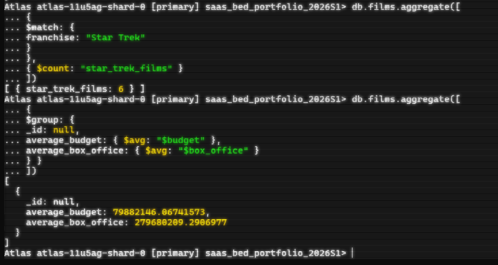

> - This aggregation pipeline groups all documents together using `_id: null`.
> - The `$avg` operator is then used to calculate the average value of the `budget` field and the average value of the `box_office` field.
> - Both averages are displayed in the result.


## 10.3 Profit earnings

- Write an aggregation query to calculate the profit (box office – budget) for the films, showing just the film title and the profit.
- Films with no budget and/or no box office should NOT be included in the results.

Query Solution:

```js
	db.films.aggregate([
    { $match: {
            budget: { $ne: null },
            box_office: { $ne: null }
        }
    },
    { $project: {
            _id: 0,
            title: 1,
            profit: {
                $subtract: ["$box_office", "$budget"] }
        }
    }
])
```
* This aggregation query, or queries, calculates the profit (box office - budget) for the films, showing just the film title and the profit.
* Films with no budget and/ or no box office should NOT be included in the results.
* This aggregation pipeline first filters out any films that do not have both a budget and box office value using `$match`.
* The `$project` stage then displays only the film title and a calculated profit field.
* The profit is calculated by subtracting the `budget` from the `box_office` using the `$subtract` operator.

Screen Shot:

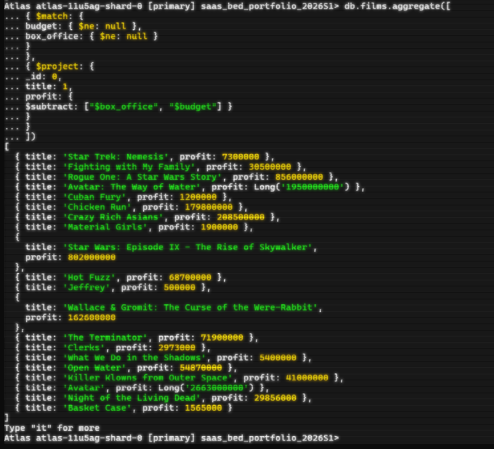


## 10.4 Grouping data

- Write the query to group films by their franchise and count the number of films in each franchise.

Query Solution:

```js
	db.films.aggregate([{
    $group: {
        _id: "$franchise",
        film_count: { $sum: 1}
    }
}
])
```

Screen Shot:
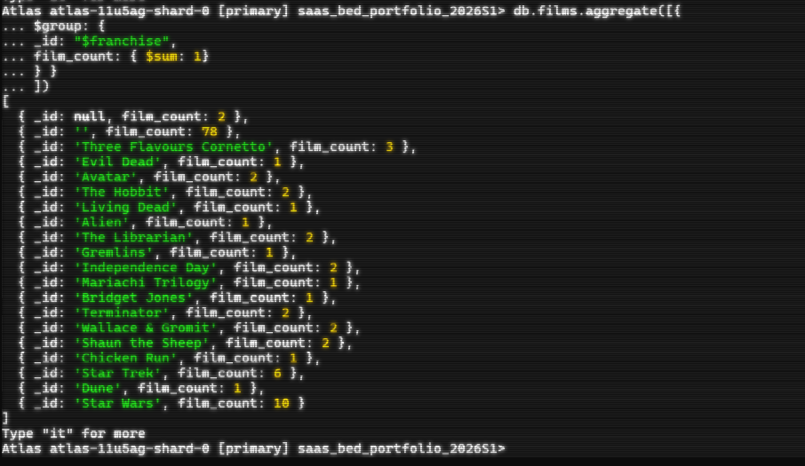

* This aggregation pipeline groups films by the `franchise` field using the `$group` stage.
* The `$sum` operator increments a counter for each document in the group, producing the total number of films in each franchise.
* The franchise name is displayed in the `_id` field and the number of films is displayed in `film_count`.


# Step 11: Triggers

Using the films collection, we are now going to create triggers to provide an audit trail for when data is added, updated or deleted.

## 11.1 Create trigger for inserted data

- Create a trigger that monitors the films collection for new data being added. 

Query Solution:

```js
	db.collection_name.find();
```

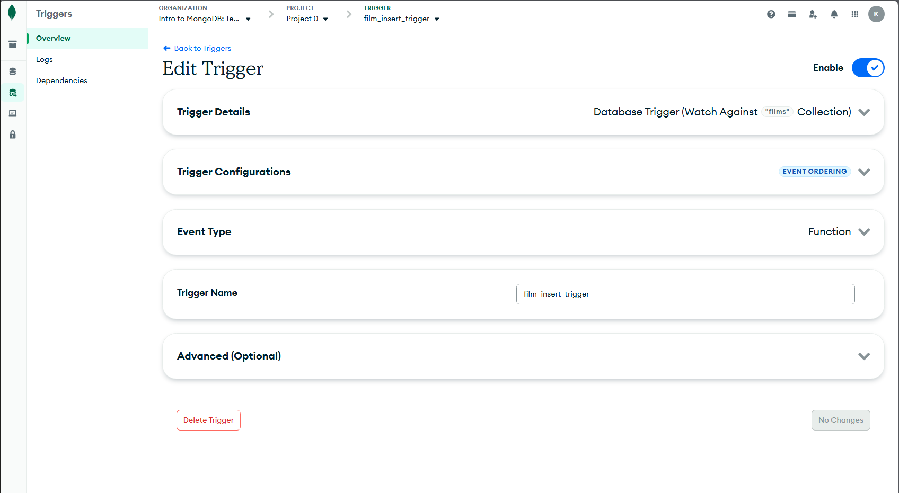
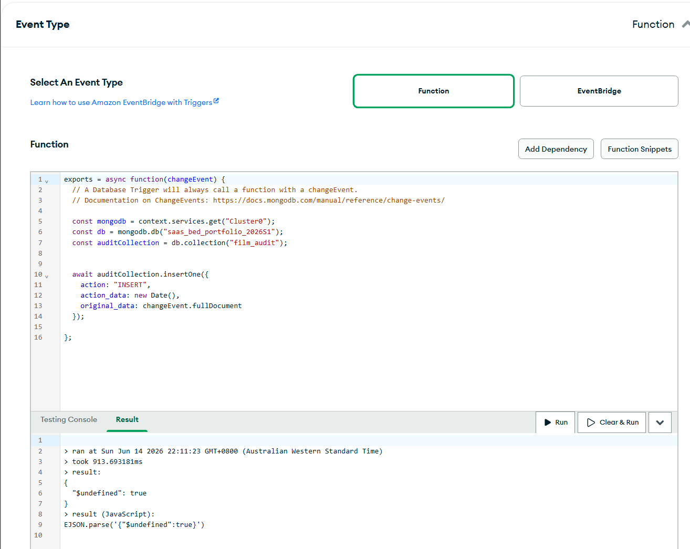


## 11.2 Testing the insert trigger works correctly

- Use the following data to check the trigger functions as expected:

Query Solution:

```js
	db.films.insertOne({
    title: "Jeffrey",
    writers: ["Paul Rudnick"],
    year: 1995,
    actors: [
        "Sigourney Weaver",
        "Patrick Stewart",
        "Michael T. Weiss",
        "Steven Weber",
        "Bryan Batt"
    ],
    box_office: 3500000,
    running_time: 92
})

db.film_audit.find().sort({ action_date: -1 }).pretty()

```
Screen Shots: 
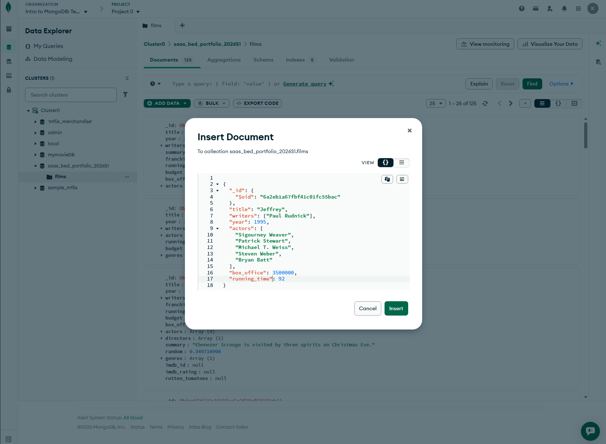

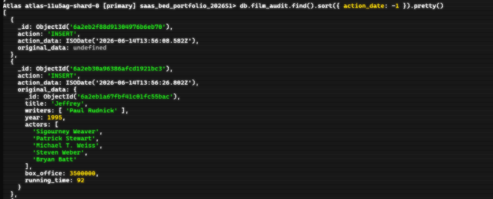

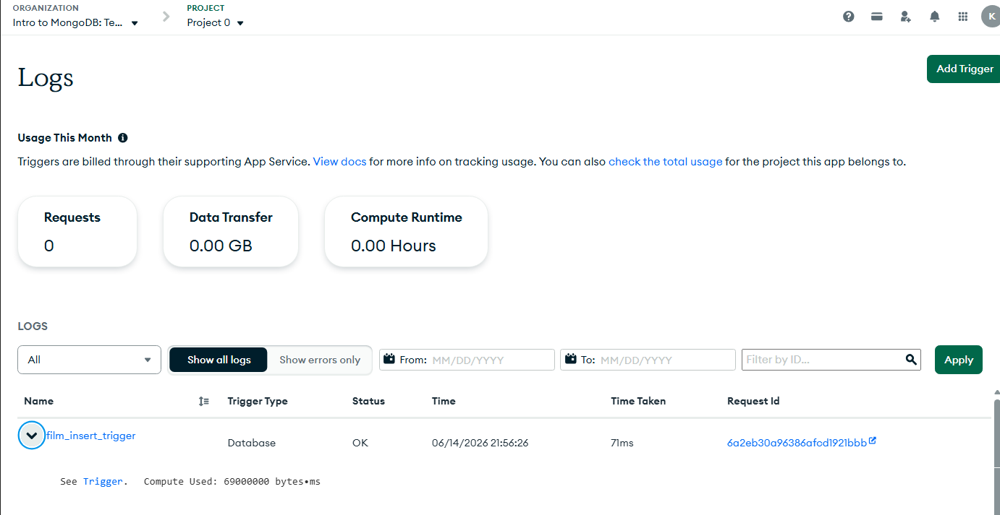

## 11.3 Create trigger for updated data

- Create a trigger that monitors the films collection for new data being added. 

Query Solution:

```js
	db.collection_name.find();
```


Screen Shot:

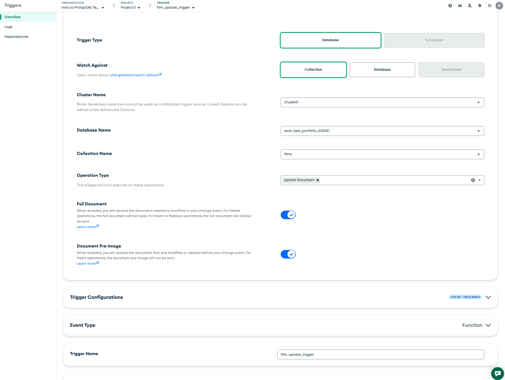
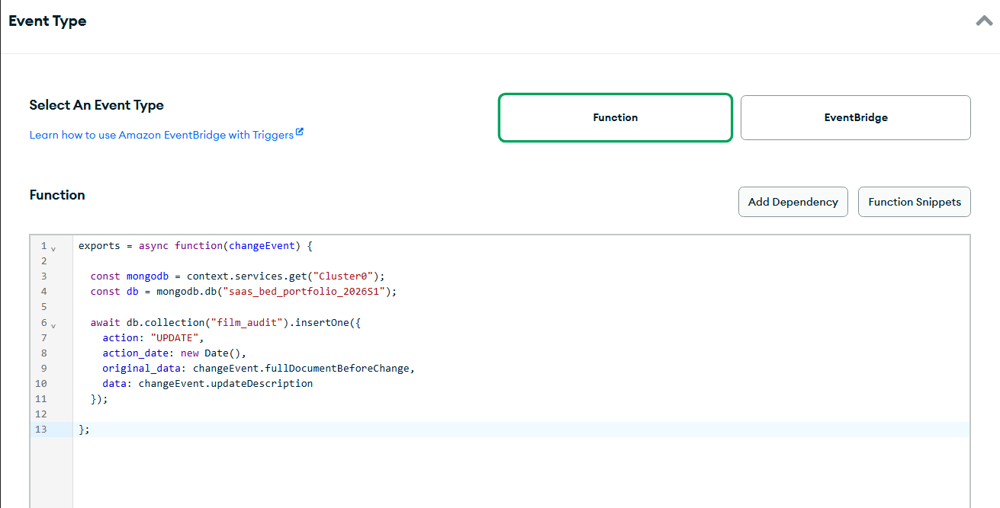


## 11.4 Testing the update trigger works correctly

- Use the following data to verify that the trigger functions as expected. Make sure that these updates are completed in more than one query:

Query Solution:

```js
	db.films.updateOne(
    { title: "Avatar" },
    { $set: { budget: 237000000, running_time: 162, box_office: NumberLong("2923000000"), franchise: "Avatar" }
    })


db.films.updateOne(
    { title: "Avatar"},
    { $addToSet: { actors: {
                $each: [ "Sam Worthington", "Zoe Saldana", "Stephen Lang", "Michelle Rodriguez", "Sigourney Weaver"] } }
    })
```
Screen Shots:
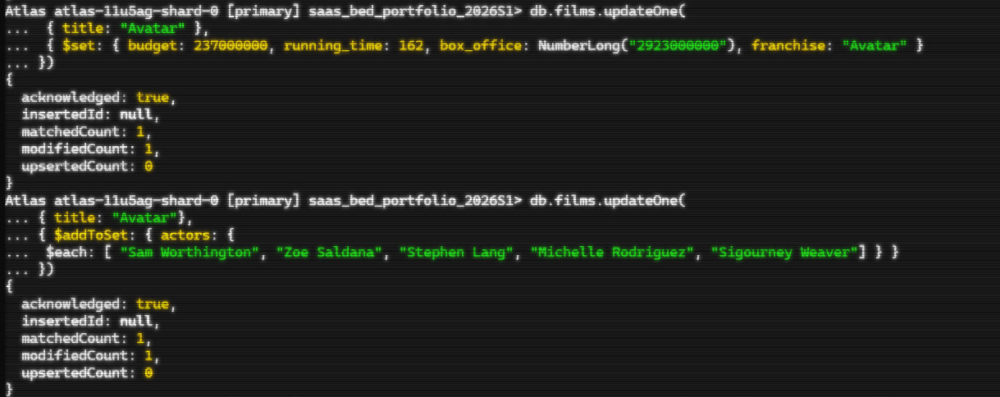
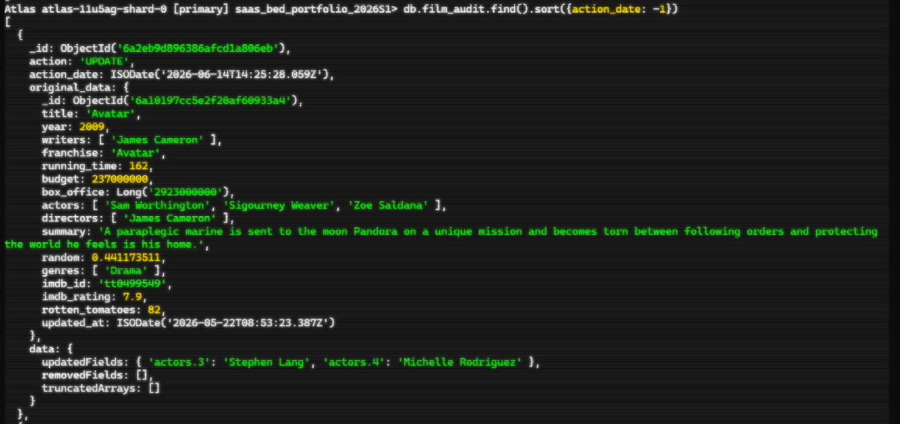
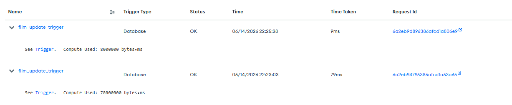


## 11.5 Create trigger for deleted data

- Create a trigger that monitors the films collection for new data being added. 

Query Solution:

```js
	db.collection_name.find();
```
Screen Shots: 
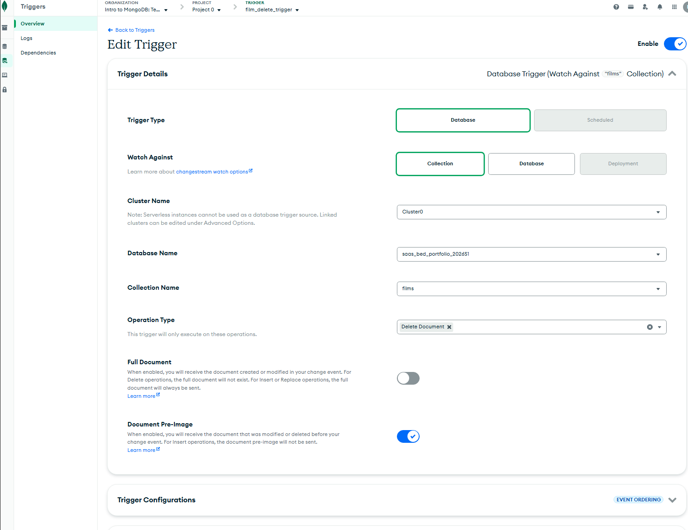
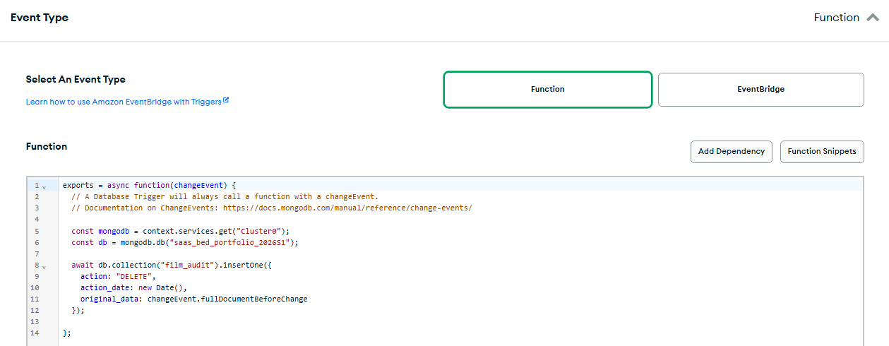


## 11.6 Testing the delete trigger works correctly

- Use the following conditions to verify that the trigger functions as expected:

Query Solution:

```js
	db.films.deleteMany({
    title: /Dummy/i
})
```
Screen Shots:
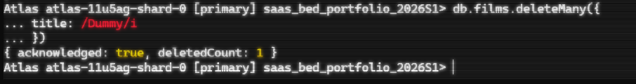
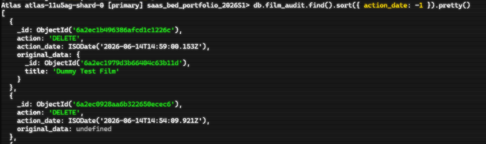
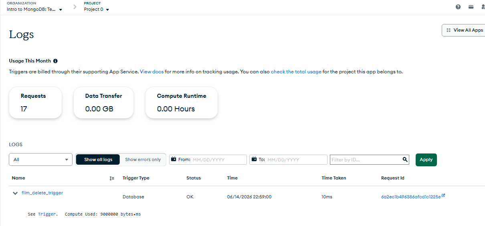


## 11.7 Verify the log contains data…

- Write a query to show the data in the film audit log.

Query Solution:

```js
	db.film_audit.find(); 
```

Screen Shots:
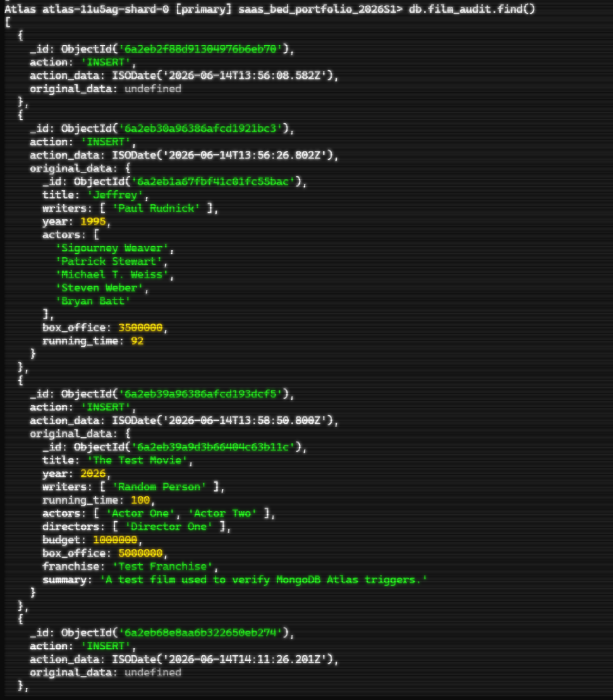


>This query retrieves all documents from the `film_audit` collection.
>The `.pretty()` method formats the output to make it easier to read.
>The results show all audit records created by the insert, update, and delete triggers,
> including the action performed, the date and time of the action, and the associated film data.

## References

1. MongoDB Inc. (2025). *MongoDB Manual*. Available at: https://www.mongodb.com/docs/manual/ (Accessed: 02 June 2026).
2. MongoDB Inc. (2025). *MongoDB Atlas Documentation*. Available at: https://www.mongodb.com/docs/atlas/ (Accessed: 02 June 2026).
3. MongoDB Inc. (2025). *Atlas Database Triggers*. Available at: https://www.mongodb.com/docs/atlas/atlas-ui/triggers/ (Accessed: 14 June 2026).
4. North Metropolitan TAFE. *Software as a Service - Back-End Development Assessment Instructions*.
5. MongoDB University. *MongoDB Tutorials*. Available at: https://learn.mongodb.com/learning-paths/data-modeling-for-mongodb
6. MongoDB University. *MongoDB Update Operators*. Available at: https://www.mongodb.com/docs/manual/reference/mql/update/?_ga=2.56665699.810066485.1665291537-836515500.1666025886
7. MongoDB Documentation. *MongoDB collection count*. Available at: https://www.mongodb.com/docs/manual/reference/method/db.collection.countdocuments/?_ga=2.30900342.810066485.1665291537-836515500.1666025886
8. MongoDB Inc. (2025). *MongoDB Aggregation Operations*. Available at: https://www.mongodb.com/docs/manual/aggregation/?msockid=033f8eb1d90f65eb10b49c3fd8cc6457
9. MongoDB University. *Intro to MongoDB*. Available at: https://learn.mongodb.com/courses/start-here-introduction-to-mongodb  
10. MongoDB Inc. (2025). *MongoDB Indexes*. Available at: https://www.mongodb.com/docs/manual/indexes/?msockid=033f8eb1d90f65eb10b49c3fd8cc6457
# Step 12: Submission

What is the URL for your GitHub (or equivalent) repository for this assessment?

```text
https://github.com/w3ngm0/kw-ict50220-saas-2-bed-nosql.git
```

# END
